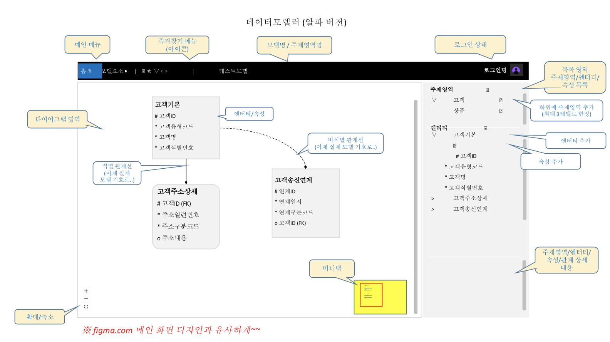

# Data Model Pilot

```
실행 방법 

최초에만 모듈 설치
yarn install

서버 실행
yarn start

```



## 도구 모음 영역

- 도구/아이콘 모음 영역

- 금번 개발에서는 아이콘 대신 문자 1~2자로 구분

가. 열기/저장 : 일반적인 파일 열기/저장 라이브러리 사용

- [N] 새 모델 : 새 모델 열기 팝업창(모델명만 기재) [완료]

- [O] 열기 : 로컬 폴더에 위치한 모델 파일 열기 [완료]

- [S] 저장 : 현재 편집 중인 모델을 파일로 저장 [완료]

- [SA] 다른 이름으로 모델 파일 저장 : 저장하기 팝업 [완료]

나. 데이터모델 구성/편집 도구 : ReactFlow 라이브러리 기능 활용

- [E] 엔터티 추가 : 아래 다이어그램 영역 설명 참고 [완료]

- [R1] 식별 관계 추가 : 아래 다이어그램 영역 설명 참고 [예정]

- [R2] 비식별 관계 추가 : 아래 다이어그램 영역 설명 참고 [예정]

다. 다이어그램 : ReactFlow 라이브러리 기능 활용

- [+] 다이어그램 화면 확대 [완료]

- [-] 다이어그램 화면 축소 [완료]

- [ㅁ] 다이어그램 화면 초기화(100%) [완료]

- [UD] Undo : 엔터티 및 관계 추가/삭제/이동 등 다이어그램 내용 undo [프리미엄결제후예정]

- [RD] Redo : undo 한 내용을 redo [프리미엄결제후예정]

---
## 다이어그램 영역

- 엔터티/속성과 관계선을 다이어그램 형태로 도식

- 최대한 ReactFlow 라이브러리 기능 활용

가. 엔터티

- 신규 엔터티 추가하면 빈 엔터티 표시(초기 엔터티명은 항상 "엔터티1") [완료] 6/21

- 엔터티 선택 후 다시 엔터티명을 선택하여 엔터티명 수정 가능함 [완료] 6/21

- 엔터티 선택 후 drag/drop 방식으로 이동 가능함 [완료] 6/21

나. 속성

- 금번 개발에서는 속성 추가/삭제/수정 기능은 속성 영역을 통해서만 작동되도록 함 [개발중]

다. 관계선

- 엔터티와 엔터티를 곡선으로 연결(connection line) 표시 [개발중]

- 금번 개발에서는 간략하게 시작점은 표시 없고, 종료점은 검은점 표시 [개발중]

(참고로, 시작점과 연결된 엔터티는 부모/1쪽 엔터티, 종료점과 연결된 엔터티는 
자식/M쪽 엔터티 의미)

- 도구 창에서 선택된 관계 유형에 따라 실선 또는 점선으로 관계선 표시

- 관계선을 자식쪽에 연결하면, 부모 엔터티의 식별 컬럼을 자식 엔터티 속성으로 자동
추가

(이때, 식별 관계선을 연결하는 것이면 식별 컬럼으로 추가하고, 비식별 관계선을
연결하는 것이면 일반 컬럼으로 추가)

- 관계선을 삭제하면, 관계선으로 인해 추가한 속성도 삭제

라. Undo/Redo

- 다이어그램 변경된 내용은 모두 Undo/Redo 되도록 함
---
## 엔터티 영역

- 다이어그램 영역에 포함된 엔터티를 목록/그리드 형태로 표시 (가능하면 오픈소스 그리드 사용)

- 다이어그램 영역에서 엔터티 선택하면 엔터티 창의 엔터티 목록 해당 엔터티 선택

- 엔터티 목록에서 엔터티 선택되면 해당 목록 하이라이트(셀 색상 밝은색 또는 텍스트 굵게) 

- 엔터티 목록에서 엔터티 선택되면 상세정보 영역 내용이 해당 엔터티 설명으로 replace되도록 함

- 그리드 내용 모두 수정 가능하도록 함 (단, 금번은 목록에 엔터티명만 표시)

## 속성 영역

- 다이어그램 영역에서 선택된 엔터티의 속성을 목록/그리드 형태로 표시 (가능하면 오픈소스 그리드 사용)

- 다이어그램 영역에서 엔터티 선택하면 속성 영역의 속성 목록이 해당 엔터티의 속성 목록으로 replace되도록 함

- 다이어그램에서 특정 속성 선택 시 속성 영역의 속성도 선택되고 하이라이트됨(셀 색상 밝은색 또는 텍스트 굵게)

- 그리드 내용 모두 수정 가능하도록 함 (금번은 속성명, 식별여부, Not Null 여부)

## 상세정보 영역

- 초기 화면에서는 공란

- 엔터티 선택 시 엔터티 설명 내용 텍스트로 표시

- 속성 선택 시 속성 설명 내용 텍스트로 표시

- 텍스트 내용 수정 가능

##  미니맵 영역

- 다이어그램을 축약해서 보여주는 미니맵

- ReactFlow 라이브러리 기능 활용
---


1. 1차 개발 범위
- PPT로 작성한 기획/설계 내용 (초안 0.5, 협의 확정 1.0 버전)
- 초안 0.5 버전으로 검토 시작하고, 협의 확정 시 1.0 버전
- 1.0버전 후 변경/추가/제외 사항은 협의 후 반영

2. 1차 개발 기간 및 금액
- 착수로 부터 약 3개월, 지급 합계 300만원
- 착수 시 50만원 지급 (총 6회 지급)
- 착수 후 약 2주 간격으로 중간 결과물 확인 후 50만원 씩 지급
- 단, 조기 완료 확인 시 잔액 일괄 지급

3. 예상 일정
- 5/17 착수 및 1회 지급(선지급)
- 5/31 중간 산출물 확인(1차 검수) 및 2차 지급
- 6/14 중간 산출물 확인(2차 검수) 및 3차 지급

- 6/28 중간 산출물 확인(3차 검수) 및 4차 지급
- 7/12 중간 산출물 확인(4차 검수) 및 5차 지급
- 7/26 중간 산출물 확인(5차 검수)
- 8/9 최종 산출물 확인(최종 6차 검수) 및 최종 6차 지급

4. 중간 및 완료 산출물 검수 기준
- 중간 산출물은 목표 범위 대비 진행 정도 고려하여 검수
- 완료 산출물은 목표한 1.의 기획/설계 내용 반영 여부 최종 확인